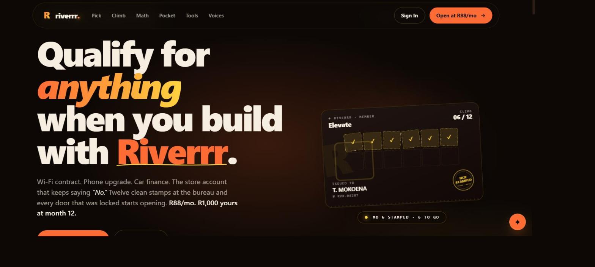
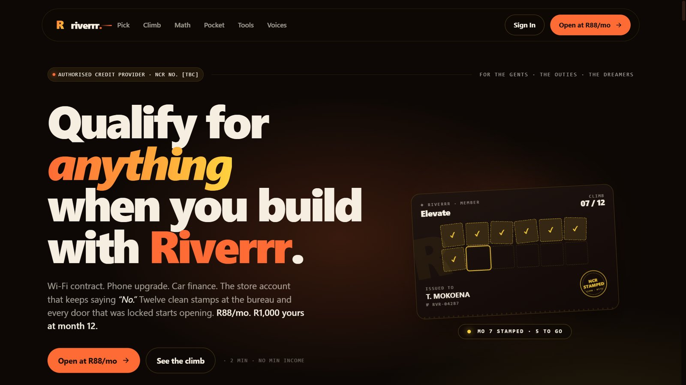

# Riverrr

**A product design project.** A credit-builder concept for South Africa, designed and built as a
working front end. Not a licensed credit provider, not taking real money, and not a live financial
product — NCR registration pending.

## The problem it's designed around

Plenty of people here have income and no credit record. No record means no Wi-Fi contract, no phone
upgrade, no car finance, and a store account that keeps saying no. The usual answer is to borrow
badly and hope it counts.

Riverrr models the other route: a small monthly commitment that gets reported to the bureau as
twelve clean months, with the money handed back at the end. The design question the whole thing is
built to answer is whether you can make that legible enough that someone actually finishes twelve
months.

## The design

**Twelve stamps, one map.** Progress is a journey with twelve nodes, not a percentage bar. Each
node is a concrete move with what it costs and why it works — first stamp at the bureau, Wi-Fi at
month 3, phone contract at month 6, score band crossing at month 9, money back at month 12. You can
see where you are and what the next move buys you.

**Three tiers, same commitment.** Spark, Elevate and Royalty all commit the same amount over twelve
months and differ in what unlocks — Elevate adds a coach that gives one Win, one Tip and one Watch
a month; Royalty matches against external credit by income. Keeping the commitment identical across
tiers was deliberate: the tier should change the guidance, never the debt.

**An itemised slip, every month.** The costliest design decision. Most credit products hide what
they charge, so this one prints a receipt: how much of the payment is the member's own savings, how
much is the fee, what twelve months costs in total, and what comes back at the end. If the true
cost is small, showing it plainly is the strongest thing you can say.

**A comparison people actually make.** The pricing is explained against what the same money buys on
a Friday, not against a competitor's rate card. That framing came out of asking who this is for.

**The tools.** Smaller products sharing one KYC and one login — funeral cover with a claim payout
window, a verified-tradesmen marketplace paid on completion, and group savings with a two-of-three
approval rule and a shared ledger.

**In the pocket.** Physics-based motion rather than slides, progressive disclosure, and a state
change when a milestone lands.

## Build

| | |
| --- | --- |
| Framework | Next.js 16, React 19, TypeScript |
| Styling | Tailwind CSS 4 |
| Database | Neon Postgres (serverless driver) + Drizzle ORM |
| Auth | Hand-rolled sessions rather than a provider |
| Payments | Paystack, in test mode |
| Bureau | An interface with a ClearScore implementation and a mock; the mock is the default |

Auth is written by hand. For anything touching money and identity I'd rather own the session model
and know exactly what's in the cookie than inherit someone else's.

The bureau integration sits behind an interface with a mock as the default, so the whole product is
workable without live bureau credentials — which also means nothing in this repo has ever talked to
a real credit bureau.

## An earlier build

The same idea, taken through a different shape first: a wallet and card, transactions, statements,
PayShap, airtime, and an app vault of finance tools in one shell.

## Status

A design and front-end project. Nothing here is a licensed financial product, no real money moves
through it, and none of it is financial advice. NCR registration pending.

---

Source is private — this repo is the write-up. [Shaun Madondo](https://github.com/TheC0deJunkie) · Durban, KwaZulu-Natal.
